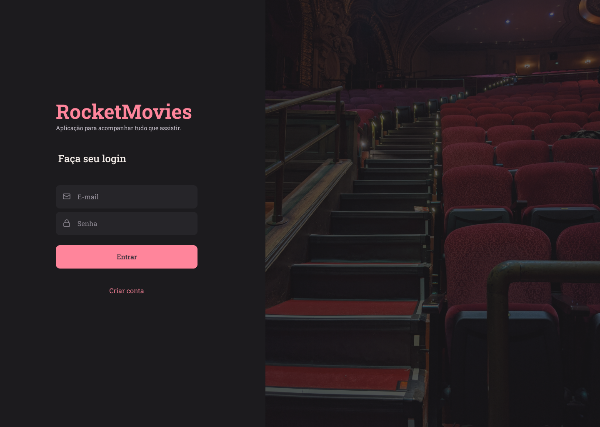

<h1 align="center"> Rocketmovies </h1>

  <a href="#-tecnologias">Tecnologias</a>&nbsp;&nbsp;&nbsp;|&nbsp;&nbsp;&nbsp;
  <a href="#-projeto">Projeto</a>&nbsp;&nbsp;&nbsp;|&nbsp;&nbsp;&nbsp;
  <a href="#-funcionalidades">Funcionalidades</a>&nbsp;&nbsp;&nbsp;|&nbsp;&nbsp;&nbsp;
  <a href="#-layout">Layout</a>&nbsp;&nbsp;&nbsp;|&nbsp;&nbsp;&nbsp;

 

## 🚀 Tecnologias

Esse projeto foi desenvolvido com as seguintes tecnologias:

- Reactjs
- Styled components
- JS
- Vite
- React router dom
- react-icons
- Typescript

## 📘 Funcionalidades

  - Login
  - Criar conta
  - Mostrar perfil
  - Atualizar perfil
  - Criar filme
  - Detalhar filme
  - Atualizar filme
  - Salvar filme

## 💻 Projeto

RocketMovies

- [Acesse o projeto finalizado, online](https://jhonimattos.github.io/focustimer).

## 🔖 Layout

Você pode visualizar o layout do projeto através [DESSE LINK](https://www.figma.com/design/iyHWEpqTAGR6m45cdf3mRV/RocketMovies-(Copy)?node-id=0-1&node-type=canvas&t=zXXkCtDBtH2q3Nlw-0) para acessá-lo.
